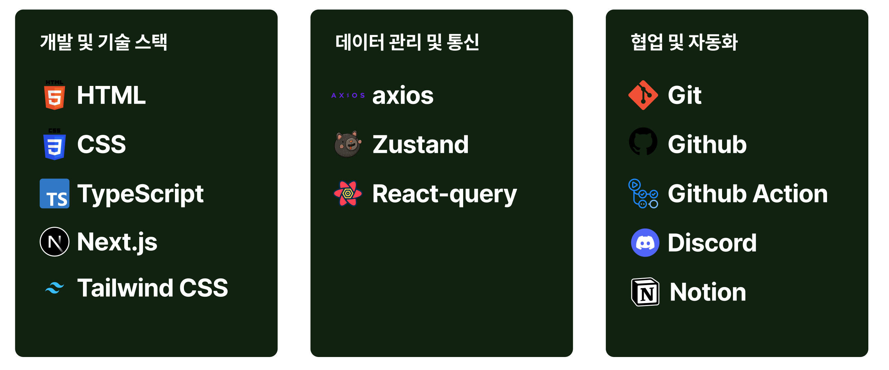

# 💡 Global Nomad

### 배포 사이트

https://globalnomad.vercel.app/

- 테스트 ID : ckx12@naver.com / asd123!!
   

# ✈ 웹 서비스 소개

- `GlobalNomad`는 사용자가 판매자와 체험자 모두의 역할을 수행할 수 있는 플랫폼입니다. 체험 상품의 예약 및 관리를 손쉽게 할 수 있는 서비스를 제공합니다.
- 캘린더 뷰 SDK와 지도 뷰 SDK를 활용하여 예약 가능한 날짜 설정, 체험 상품 브라우징, 상세 확인, 예약 기능 등을 제공합니다.

 

# ✏ 개발 팀 소개

<table>
  <tbody>
    <tr>
      <td align="center">
        <a href="">
           
          <b>FE 팀장 : 박문균</b>
        </a> 
      </td>
      <td align="center">
        <a href="">
           
          <b>FE 팀원 : 김충오</b>
        </a> 
      </td>
      <td align="center">
        <a href="">
           
          <b>FE 팀원 : 김민준</b>
        </a> 
      </td>
      <td align="center">
        <a href="">
           
          <b>FE 팀원 : 박상욱</b>
        </a> 
      </td>
    </tr>
    <tr>
      <td align="left">
        - 공통 컴포넌트 페이지네이션 
        - 체험 상세 페이지 
        - 예약 현황 페이지 
        - 알림 모달 & 토큰 재발급 기능 
      </td>
      <td align="left">
        - 공통 컴포넌트 button & input 
        - 체험 등록 페이지 
        - 체험 수정 페이지 
        - 간편 로그인 & 회원가입
      </td>
      <td align="left">
        - 공통 컴포넌트 image box 
        - 내 정보 페이지 
        - 내 체험 관리 페이지 
        - 예약 내역 페이지
      </td>
      <td align="left">
        - header & footer 
        - 메인 페이지 
        - 후기 작성 기능 
        - 로그인 & 회원가입 페이지 UI
      </td>
    </tr>
  </tbody>
</table>

 

# 🗂 기술 스택

 

# 📕 페이지 기능

### 🎈 Login 페이지

- 유효한 이메일과 비밀번호를 입력하고 '로그인 하기' 버튼을 클릭하면 메인 페이지로 이동합니다.
- 눈 모양 아이콘을 누르면 비밀번호를 숨기거나 나타납니다.
- 이메일, 비밀번호 input에서 focus out 시, 값이 이메일 형식이 아닐 경우 input에 빨강색 테두리와 “이메일 형식으로 작성해 주세요.” 빨강색 에러 메세지가 보입니다.
- 로그인 성공 시 엑세스 토큰이 발급됩니다.

### 🎈 회원가입 페이지

- Input에서 focus out 시, 값이 열 자 이하가 아닐 경우 input에 빨간색 테두리와 빨간색 에러 메시지가 표시됩니다.
- 모든 input 창이 채워지고 에러 메시지가 없는 상태에서 이용약관에 체크가 되면 '회원가입 하기' 버튼이 활성화됩니다.
- 활성화된 '가입하기' 버튼을 누르면 “가입이 완료되었습니다” 토스트창이 나타나고 로그인 페이지로 이동합니다.
  

### 🎈 메인 페이지

- 특정 카테고리를 클릭하면 해당 카테고리에 속하는 체험만 필터링되며, 최신순으로 페이지네이션이 적용됩니다.
- 드롭다운에서 가격이 낮은 순 또는 높은 순을 선택하면 해당 기준으로 정렬되며, 페이지네이션이 적용됩니다.
- 검색어 입력 후 '검색하기' 버튼을 클릭하면 입력한 검색어가 포함된 제목의 체험만 필터링되며, 최신순과 페이지네이션이 적용됩니다.
- 특정 체험을 클릭하면 해당 체험의 상세 페이지로 이동합니다.
  
   

### 🎈 체험 상세 페이지

- 내가 만든 체험인 경우에만 오른쪽 상단에 케밥 버튼이 나타납니다.
- 내가 만든 체험인 경우 예약 카드가 보이지 않도록 설정됩니다.
- 케밥 버튼을 클릭하면 수정, 삭제 옵션이 나타납니다.
- 캘린더에서 특정 날짜를 선택하면 체크박스로 예약 가능한 시간을 선택할 수 있습니다.
- 예약 가능한 시간을 선택하고 참여 인원수를 선택한 뒤 '예약하기' 버튼을 클릭하면 “예약이 완료되었습니다.”라는 모달창이 나타납니다.
- 체험 위치는 카카오 지도를 통해 표시됩니다.
  

 

### 🎈 내 정보 페이지

- '연필' 버튼을 클릭하면 이미지를 업로드할 수 있도록 설정됩니다.
- 기본 이미지는 `react-icons`를 활용합니다.
- 닉네임, 이미지, 비밀번호를 변경한 뒤 '수정하기' 버튼을 클릭하면 내 정보가 수정됩니다.
  

 

### 🎈 예약 내역 페이지

- 예약 내역은 최신순으로 무한 스크롤로 정렬됩니다.
- 예약 상태는 예약 신청, 예약 취소, 예약 승인, 예약 거절, 체험 완료로 분류됩니다.
- 예약 완료된 체험은 '예약 취소' 버튼을 통해 취소할 수 있습니다.
- '예약 취소' 버튼을 클릭하면 해당 체험의 예약이 취소됩니다.
- 체험 시간이 지난 이용 완료된 체험은 '후기 작성' 버튼이 표시됩니다.
- '후기 작성' 버튼을 클릭하면 모달창이 나타납니다.
  
  

 

### 🎈 내 체험 관리 페이지

- 내가 등록한 체험 목록은 최신순으로 무한 스크롤로 정렬됩니다.
- '체험 등록하기' 버튼을 클릭하면 내 체험 등록 페이지로 이동합니다.
- '수정하기' 버튼을 클릭하면 특정 체험 수정 페이지로 이동합니다.
- '삭제하기' 버튼을 클릭하면 “삭제하시겠습니까?”라는 모달창이 나타납니다.
  

 

### 🎈 내 체험 등록하기 페이지

- 제목, 카테고리, 설명, 가격, 주소, 예약 가능한 시간대, 배너 이미지는 필수 입력 필드로 설정됩니다.
- 카테고리는 문화 예술 | 식음료 | 스포츠 | 투어 | 관광 | 웰빙으로 제한되며, 드롭다운 메뉴로 선택할 수 있습니다.
- '+' 버튼을 클릭하면 예약 가능한 시간이 추가됩니다.
- 배너 이미지는 최대 1개, 소개 이미지는 최대 4개 업로드 가능하며 필수 항목으로 설정됩니다.
- 기존 체험 정보는 수정 페이지에 자동으로 채워집니다.
- 수정 후 '수정하기' 버튼을 클릭하면 “수정이 완료되었습니다”라는 모달창이 나타납니다.
  

 

### 🎈 내 체험 예약 현황 페이지

- 드롭다운으로 내가 등록한 체험을 선택할 수 있도록 설정됩니다.
- 선택한 체험에 대한 신청 내용이 완료, 예약, 승인으로 분류되어 캘린더에 표시됩니다.
- 예약 승인된 체험은 체험 시간이 지나면 자동으로 상태가 완료로 변경됩니다.
- 특정 날짜를 클릭하면 해당 날짜의 신청, 승인, 거절 내역이 최신순으로 무한 스크롤로 정렬됩니다.
- '거절하기' 버튼을 클릭하면 해당 예약이 거절 상태로 변경됩니다.
  
